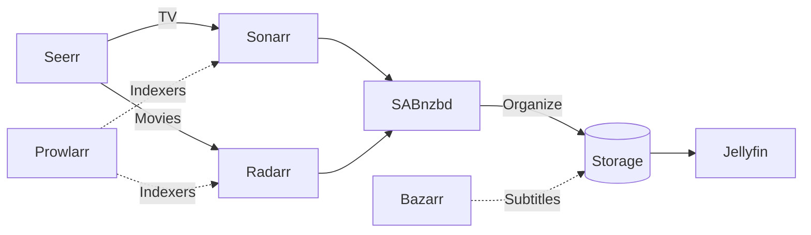

# Docker Media Server

Automated media management on Docker — requesting, downloading, organizing, and subtitling — with
Jellyfin running separately for playback.

## Architecture



## Services

| Service | Port | Purpose | Guide |
| --- | --- | --- | --- |
| [Seerr](https://github.com/seerr-team/seerr) | 5055 | Media request portal | [Guide](docs/seerr.md) |
| [Sonarr](https://wiki.servarr.com/sonarr) | 8989 | TV show management | [Guide](docs/sonarr.md) |
| [Radarr](https://wiki.servarr.com/radarr) | 7878 | Movie management | [Guide](docs/radarr.md) |
| [SABnzbd](https://sabnzbd.org/wiki/) | 8080 | Usenet downloader | [Guide](docs/sabnzbd.md) |
| [Bazarr](https://wiki.bazarr.media/) | 6767 | Automatic subtitles | [Guide](docs/bazarr.md) |
| [Prowlarr](https://wiki.servarr.com/prowlarr) | 9696 | Indexer management | [Guide](docs/prowlarr.md) |
| [Recyclarr](https://recyclarr.dev/) | — | TRaSH quality profile sync | [Guide](docs/recyclarr.md) |
| [Uptime Kuma](https://github.com/louislam/uptime-kuma) | 3001 | Monitoring and alerting | [Guide](docs/uptime-kuma.md) |
| [Tailscale](https://tailscale.com/kb/1282/docker) | — | VPN for remote access | [Guide](docs/tailscale.md) |
| [cloudflared](https://developers.cloudflare.com/cloudflare-one/connections/connect-networks/) | — | Public hostnames, opt-in | [Guide](docs/cloudflared.md) |

That's the whole stack, deliberately. Everything here is running in a real install, so the guides
describe what actually works rather than what should.

## Quick Start

```bash
git clone https://github.com/matthull/docker-media-server.git
cd docker-media-server
cp .env.example .env                                          # paths, timezone, Tailscale key
cp docker-compose.override.yml.example docker-compose.override.yml
docker compose up -d
```

The override file is not optional if you care about hardlinks: it mounts `${MEDIA_ROOT}` once as
`/data` instead of passing `/tv`, `/movies` and `/downloads` separately. Separate bind mounts look
like separate filesystems to the container, so `link()` fails and every import silently becomes a
full copy. Its header explains the layout.

Then configure each service through its web UI — see the
[guides in docs/](docs/Home.md). Before the first import, set up
[Jellyfin Library Updates](docs/jellyfin-library-updates.md):
Jellyfin never notices a title imported into an empty library folder, and nothing reports it.

## Back Up Your Config

The configs are the painful part to lose; the media is re-downloadable.

```bash
sudo ./backup/install-local-backup-timer.sh   # weekly tarball to another disk, no credentials
```

For off-site copies via restic, see the
[Backups guide](docs/backups.md).

## More

- [Tailscale / Remote Access](docs/tailscale.md) ·
  [Cloudflare Tunnel](docs/cloudflared.md)
- [Backups](docs/backups.md) ·
  [Usenet Indexers](docs/usenet-indexers.md)
- [TRaSH Guides](https://trash-guides.info/) · [Servarr Wiki](https://wiki.servarr.com/) ·
  [LinuxServer.io](https://docs.linuxserver.io/)
